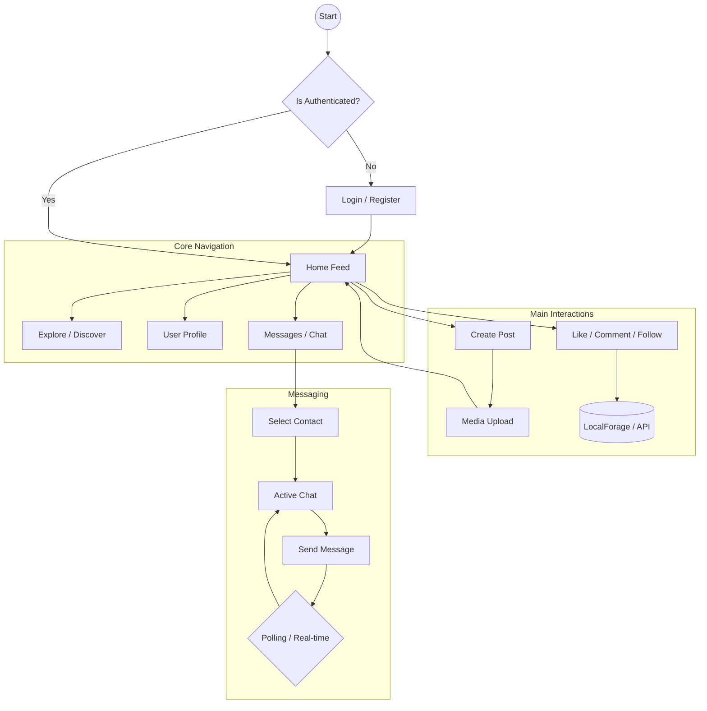

# 🚀 FriendLeap - Modern Social Media Platform

FriendLeap is a premium, feature-rich social media application designed for seamless connection and engagement. Built with a cutting-edge tech stack, it provides a professional-grade user experience with fluid animations, a responsive 3-column layout, and robust features.


## ✨ Features

- **Dynamic Feed**: Personalized home feed showing posts from users you follow.
- **Rich Media Posting**: Share your thoughts with support for high-quality images and videos.
- **Real-time Interactions**: Like, comment, and engage with content instantly.
- **Social Graph**: Follow and unfollow users to customize your network.
- **Secure Authentication**: Robust login system with persistent sessions.
- **Private Messaging**: Integrated chat system for one-on-one conversations.
- **Advanced Profiles**: Detailed user profiles showcasing activity, stats, and media.
- **Responsive Design**: Pixel-perfect experience across mobile, tablet, and desktop.
- **Offline Capability**: Data persistence using `localforage` for a smooth experience even with spotty connections.

## 🛠️ Tech Stack

- **Framework**: [React 19](https://react.dev/)
- **Build Tool**: [Vite 8](https://vitejs.dev/)
- **Styling**: [Tailwind CSS 4](https://tailwindcss.com/)
- **Routing**: [React Router v7](https://reactrouter.com/)
- **State & Persistence**: [Localforage](https://localforage.github.io/localForage/)
- **HTTP Client**: [Axios](https://axios-http.com/)
- **UI Components**: [Headless UI](https://headlessui.com/), [Heroicons](https://heroicons.com/)
- **Icons**: [FontAwesome](https://fontawesome.com/)
- **Backend (Mock)**: [JSON Server](https://github.com/typicode/json-server)

## 📊 Application Flow

The following diagram illustrates the core user journey and application architecture:



## 📁 Project Structure

```text
FriendLeap/
├── src/
│   ├── assets/          # Static assets (images, logos)
│   ├── components/      # Reusable UI components
│   │   ├── common/      # Basic elements (Buttons, Inputs)
│   │   ├── layout/      # Layout wrappers (Navbar, Sidebar)
│   │   └── post/        # Post-specific components (Chat, Messages)
│   ├── hooks/           # Custom React hooks
│   ├── Pages/           # Top-level page components
│   ├── services/        # API and Mock data services
│   ├── utility/         # Helper functions
│   ├── App.jsx          # Main routing logic
│   └── main.jsx         # Application entry point
├── public/              # Static files
├── db.json              # Mock database for JSON Server
└── package.json         # Dependencies and scripts
```

## 🚀 Getting Started

### Prerequisites
- Node.js (v18 or higher)
- npm or yarn

### Installation

1. **Clone the repository**
   ```bash
   git clone https://github.com/Sunilvk19/Social-Media.git
   cd FriendLeap
   ```

2. **Install dependencies**
   ```bash
   npm install
   ```

3. **Start the development server**
   ```bash
   npm run dev
   ```

4. **Start the Mock Backend (Optional)**
   If using the JSON server for persistent data:
   ```bash
   npx json-server --watch db.json --port 5000
   ```

## 🎨 Design Philosophy

FriendLeap follows a **Modern Minimalism** aesthetic:
- **Glassmorphism**: Subtle translucent backgrounds for a premium feel.
- **Micro-animations**: Smooth transitions and hover effects to enhance engagement.
- **Fluid Layout**: A 3-column architecture that maximizes information density while maintaining clarity.
- **Typography**: Clean, sans-serif fonts (Inter/System) for maximum readability.

---

Built with ❤️ by [Sunilvk19](https://github.com/Sunilvk19)
